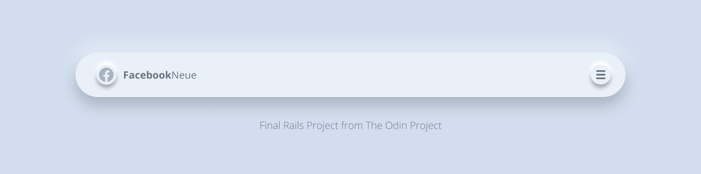

# Project: Facebook Clone

The final project for the [The Odin Project Ruby on Rails Course](https://www.theodinproject.com/courses/ruby-on-rails/lessons/final-project) to apply all the learnings of core concepts such as using the Rails Framework, modelling data, setting up Active Storage, working with forms, and implementing authentication. The site is a Facebook clone, with basic features such as friending other users and creating posts to share with friends.

## Features 

Users can sign up to the site either by creating a new account or logging in with their Facebook account. Authentication is handled by the Devise gem, along with OmniAuth Facebook. When a user completes the sign up process an email is sent out welcoming the new user. (Note: the mailer feature is only available for locally cloned apps, not the live demo) 

Once logged in, the user can update their profile, adding a profile picture to represent themselves as an icon. They can also include information such as birthdays, hometowns, relationship statuses to personalize their page. 

Users can friend other users. Once a friend request is sent, the respective party will see a notification in the navigation bar, then can either accept or decline the request. While the friend request is pending, the sender can cancel their friend request if desired. If the friend request is accepted, the two users become friends, and then can unfriend each other in dire circumstances. 

Additionally. users can create posts, either with an image or without. Posts can be liked, unliked, or commented. Only friends of the user will be able to see the posts, and therefore comment or like it. Strangers cannot see, like, or comment on the posts. Posts are shown from most recent to least recent. 

Images are hosted on the Google Cloud Platform and uses Active Storage to manage from the Rails side.


## Demo
TBD

## Gems Used
* [Devise](https://github.com/heartcombo/devise)
* [Better Errors](https://github.com/BetterErrors/better_errors) (Dev Only)
* [Bulma](https://bulma.io/)
* [Letter Opener](https://github.com/ryanb/letter_opener) (Dev Only)
* [OmniAuth Facebook](https://github.com/simi/omniauth-facebook)
* [Figaro](https://github.com/laserlemon/figaro)
* [Google Cloud Storage](https://github.com/googleapis/google-cloud-ruby/tree/master/google-cloud-storage)

## Get Started 
Make sure you have Rails and Git installed on your machine before proceeding. 

See below for steps: 
```bash
# First clone this repo to your local machine
$ git clone https://github.com/zxum/flight-booker.git

# Install any required gems 
$ bundle install 

# Migrate the database 
$ rails db:migrate 

# Load the sample data (optional)
$ rails db:seed

# Create configuration file from figaro 
$ bundle exec figaro install 
```

See below on how to set up your own Google Cloud Storage and Facebook Developer Account.


```bash
# Start local server 
$ rails server 
```
Once all the above is complete, open a web browser and go to localhost:3000 

## Reflections 
TBD

***

## Appendix

### Set Up Google Cloud Storage 
1. Set up an account with Google Cloud Platform. 

2. Create a Cloud Storage bucket with a globally unique name. 

3. Go to APIs & Services in the left pane menu, then go to the Credentials page. 

4. Click on the Create Credentials option and select 'Service Account'.

5. Name your service account, gve it the Storage Admin role, and associate it to the Cloud Storage bucket you previously created. 

6. Click on the Id of the service account you just created and go to the bottom to Add Key. 

7. Select JSON format. 

8. You will be notified that a file will be downloaded, which will be your credentials document. Save the file and rename it something relevant to the project. 

9. Add the file to config/secrets. 

### Set Up Facebook Developer Account 
1. Create or use your Facebook account to start a [Facebook developer](https://developers.facebook.com/) account. 

2. Go to My Apps 

3. Click on Create App and select the purpose.

4. Name your App, and click Create App. 

5. Go to the Settings of the App you just created and copy your App ID and App Secret to the application.yml file in configs folder. Make sure to to use facebook_oauth_id and facebook_oauth_secret as your keys. 
